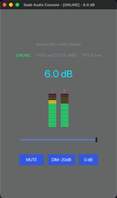

# Saab Audio Mixing Console Streaming

Low-latency digital audio mixing console and streaming system in Rust. Inspired by the precision cockpit ergonomics and aeronautical engineering of the iconic **Saab 900 Turbo**, this project transmits uncompressed high-resolution PCM audio from macOS to Android 12+ devices over UDP and USB, routing output to external sound systems via 3.5mm P2/auxiliary interfaces, with bidirectional WebSocket control and a dedicated studio touch console.

---

## Overview

SaabAudioMixingConsoleStreaming is designed for real-time, zero-lag audio routing between a macOS workstation and an Android receiver device. It captures master system audio digitally through macOS CoreAudio HAL and the **BlackHole 16ch** virtual audio loopback driver with zero additional latency, applies avionics-grade digital signal processing (DSP) in domain space, and streams bit-exact audio over local networks and direct USB connections.

### Architecture Highlights

- **Pure PCM UDP/USB Streaming**: Bit-exact high-resolution stereo float32 audio transmission (44.1kHz to 192kHz) with sub-5ms network latency.
- **Hexagonal Architecture (Ports and Adapters)**: Strict decoupling of domain logic, communication contracts, and platform drivers.
- **Zero-Latency CoreAudio Loopback**: Integration with `BlackHole 16ch` (and 2ch/64ch variants) for clean digital loopback capture without screen recording indicators, GPU compositor overhead, or audio echoing on Mac speakers.
- **Broadcast ITU-R BS.775 Downmixing**: Automatic weighted downmixing from 16-channel and surround (5.1/7.1) sources to clean stereo for physical P2 line outputs.
- **Android Low-Latency Output**: Dedicated Google Oboe (AAudio) engine configured for exclusive low-latency operation targeting 3.5mm P2 and USB-C DAC outputs on Android 12+ (API 31+).
- **DSP Engine**: Broadcast-standard logarithmic faders (-inf to +6dB) with frame-accurate 5ms linear gain ramps to eliminate transient pop and click artifacts during volume transitions.
- **Continuous Telemetry & Metering**: 60fps RMS and True Peak metering with exponential peak hold decay, clipping detection, and round-trip time (RTT) calculation via WebSocket ping/pong messages.
- **Touch Interface**: Studio console interface built with the `iced` GUI toolkit, suitable for desktop and mobile form factors.

---

## Core Libraries and Dependencies

The following core libraries power the streaming, audio DSP, networking, and user interface layers of the application:

| Library | Role in Architecture | Repository |
| :--- | :--- | :--- |
| **`cpal`** | Cross-platform audio I/O in pure Rust. Interfaces directly with macOS CoreAudio HAL to capture zero-latency digital loopback streams from BlackHole. | [github.com/RustAudio/cpal](https://github.com/RustAudio/cpal) |
| **`oboe` / `oboe-sys`** | Rust bindings for Google's high-performance C++ Oboe audio library on Android. Provides direct AAudio exclusive access for lowest possible hardware latency (<5ms) and hardware routing to the 3.5mm P2 audio jack. | [github.com/google/oboe](https://github.com/google/oboe) |
| **`ringbuf`** | Lock-free Single-Producer Single-Consumer (SPSC) circular buffer. Bridges real-time, non-blocking audio capture/playback callbacks with asynchronous network tasks with zero allocation and zero lock contention. | [github.com/agerasev/ringbuf](https://github.com/agerasev/ringbuf) |
| **`tokio`** | Event-driven, asynchronous I/O runtime. Manages non-blocking UDP audio packet reception, high-throughput network streaming, and concurrent WebSocket servers and clients. | [github.com/tokio-rs/tokio](https://github.com/tokio-rs/tokio) |
| **`tokio-tungstenite`** | Lightweight, high-performance asynchronous WebSocket implementation for Tokio. Handles real-time bidirectional synchronization of fader levels, mute/dim controls, and telemetry broadcasts. | [github.com/snapview/tokio-tungstenite](https://github.com/snapview/tokio-tungstenite) |
| **`iced`** | Cross-platform GUI framework inspired by Elm. Powers the tactile studio mixing console interface with dark studio aesthetics, 20-segment responsive VU meters, and illuminated control switches. | [github.com/iced-rs/iced](https://github.com/iced-rs/iced) |
| **`serde` / `serde_json`** | Zero-copy serialization and deserialization framework. Powers serialization of WebSocket control commands, VU meter telemetry payloads, and latency diagnostics. | [github.com/serde-rs/serde](https://github.com/serde-rs/serde) |
| **`byteorder`** | Low-level binary decoding and encoding utilities. Used for bit-level packing and unpacking of the 28-byte UDP `AudioPacketHeader` and IEEE 754 float32 PCM samples. | [github.com/BurntSushi/byteorder](https://github.com/BurntSushi/byteorder) |
| **`thiserror`** | Ergonomic macro for creating typed error definitions. Manages domain and adapter error hierarchies (`CoreError`, `ProtocolError`) without runtime overhead. | [github.com/dtolnay/thiserror](https://github.com/dtolnay/thiserror) |

---

## BlackHole Variants Guide

The acronym **"ch"** stands for independent **Audio Channels**. All variants operate in macOS CoreAudio HAL with **zero additional driver latency**:

| Version | Channel Count | Production Use Case | Recommended for Project? |
| :--- | :--- | :--- | :--- |
| **`BlackHole 16ch`** | **16 Independent Channels** | Music production in DAWs (Logic Pro, Ableton, Reaper), advanced OBS multitrack routing, distinct sub-mixes (Game, Discord, Music), and 5.1/7.1 surround audio feeds. | **PROJECT STANDARD (Recommended)** |
| **`BlackHole 2ch`** | **2 Channels (Stereo: Left & Right)** | Standard stereo playback, Spotify, YouTube, common gaming, voice calls, and basic streaming. | Full Compatibility (Auto-Discovery) |
| **`BlackHole 64ch` / `256ch`** | **64 / 256 Independent Channels** | Large-scale recording studios, multi-instrument orchestral tracking, and complex industrial audio arrays. | Full Compatibility (Auto-Discovery) |

---

## System Architecture

```
+-------------------------------------------------------------+
|                         macOS Server                        |
|  - BlackHole 16ch CoreAudio HAL Loopback Stream             |
|  - ITU-R BS.775 Broadcast Downmixer (16ch/5.1 -> Stereo)    |
|  - MixerService DSP (Volume Curves, Gain Ramp, Mute State)  |
|  - VU Meter Processor & Telemetry Broadcaster               |
+------------------------------+------------------------------+
                               |
            +------------------+------------------+
            |                                     |
   [UDP/USB Audio Stream]                 [WebSocket Control]
   Raw PCM Float32 (44.1k - 192kHz)       Bidirectional Channel
   28-byte Binary Header                  - Fader / Mute Commands
   Latency: <5ms                          - 60fps VU Meters / RTT
            |                                     |
            +------------------+------------------+
                               |
                               v
+-------------------------------------------------------------+
|                    Android 12+ / Desktop Client             |
|  - Lock-free SPSC Ring Buffer (Jitter Buffer)               |
|  - Google Oboe / AAudio Exclusive Output Engine             |
|  - Iced Studio Touch Console UI                             |
+------------------------------+------------------------------+
                               |
                               v
                 [ 3.5mm P2 / Line Output ]
                               |
                               v
                    External Sound Hardware
```

---

## Workspace Layout

```
SaabAudioMixingConsoleStreaming/
├── crates/
│   ├── protocol/        # Binary UDP packet header and WebSocket JSON DTOs
│   ├── core/            # Domain entities, DSP value types, and Ports
│   ├── server/          # macOS backend: CoreAudio BlackHole capture, UDP streamer, WebSocket server
│   └── client/          # Client frontend: Iced UI, UDP receiver, CPAL & Oboe playback
├── scripts/
│   └── build_android.sh # Cargo-NDK build and ADB deployment script for Android 12+
├── specs/               # Product Requirements and Architecture Specifications
└── tests/               # End-to-end loopback and synchronization test suites
```

---

## Getting Started

### Prerequisites

- **Rust**: Version 1.75 or later (`rustup default stable`)
- **macOS Audio Driver**: Install BlackHole 16ch via Homebrew:
  ```bash
  brew install blackhole-16ch
  ```
- **Android Target** (for Android compilation):
  - `cargo install cargo-ndk`
  - `rustup target add aarch64-linux-android`
  - Android NDK (r25 or later) with environment variable `ANDROID_NDK_HOME` configured

---

## Installation via Homebrew

Install the `saab` CLI directly from this repository:

```bash
# 1. Tap this repository
brew tap maxsonferovante/saab https://github.com/maxsonferovante/SaabAudioMixingConsoleStreaming

# 2. Install saab CLI & macOS Server
brew install saab
```

Or install directly via the formula URL:
```bash
brew install https://raw.githubusercontent.com/maxsonferovante/SaabAudioMixingConsoleStreaming/main/Formula/saab.rb
```

---

## Quick Start with `saab` CLI

The `saab` CLI eliminates multi-terminal operational friction by managing the entire audio streaming lifecycle through background services:

```bash
# 1. Interactive setup with hardware auto-discovery
saab configure

# 2. Launch macOS server and Android node in the background
saab start

# 3. Open the Dedicated Studio Touch Console (Iced GUI)
saab studio

# 4. Check real-time service health, driver, and latency
saab status

# 5. Stream real-time logs
saab logs --server-mac
saab logs --device-android

# 6. Stop all background services cleanly
saab stop
```

---

### Manual Execution (Development Mode)

If you prefer to run services manually in dedicated terminal windows during development:

1. **Terminal 1: Start macOS Capture Server**
   ```bash
   cargo run --bin server -- <ANDROID_DEVICE_IP>:48480
   ```
2. **Terminal 2: Deploy & Start Android Audio Daemon**
   ```bash
   ./scripts/build_android.sh
   ```
3. **Terminal 3: Launch Studio Touch Console**
   ```bash
   cargo run --bin client
   ```

---

### Common Issues and Troubleshooting

#### 1. Zero Audio / Complete Silence (`SILENCE - check macOS Output`)

If the server logs indicate packets are being transmitted but reports silence:

- **macOS Microphone / Audio Input Permission**:
  On macOS (Sonoma, Sequoia, and later), any terminal emulator or IDE capturing CoreAudio input streams (including virtual loopback drivers like BlackHole) requires explicit **Microphone permission**. When this permission is absent, macOS CoreAudio does not throw an error; instead, it intentionally replaces all captured samples with zeros (`0.000000`) for privacy reasons.

  **Resolution**:
  1. Open **System Settings -> Privacy & Security -> Microphone** (*Ajustes do Sistema -> Privacidade e Segurança -> Microfone*).
  2. Locate your **Terminal** (or **iTerm**, **Cursor**, **VSCode**) in the list and enable the toggle.
  3. If already enabled, toggle it OFF and ON again to reload the CoreAudio security token.

- **Browser and Application Output Binding (Chrome, Spotify)**:
  Chromium-based browsers (Chrome, Brave, Edge) and media players maintain open audio stream handles to the previous default output device until refreshed.
  - **YouTube / Web Browser**: Reload the tab (`Cmd + R` or `F5`) to re-bind audio context to BlackHole.
  - **Spotify**: Pause and unpause playback, or restart the Spotify application.

- **Driver Reload Without Rebooting**:
  If BlackHole was installed via Homebrew and does not immediately appear in the CoreAudio device list, restart the CoreAudio daemon:
  ```bash
  sudo killall coreaudiod
  ```

---

## Dedicated Studio Touch Console (Iced GUI)

The **Dedicated Studio Touch Console** is the professional graphical control interface of the system, built with the `iced` GUI framework in pure Rust. It operates as a physical digital studio mixer with a sleek *Studio Dark* aesthetic.

<p align="center">
  
</p>

### 1. Console Features and Subsystems

- **Tactile Logarithmic Fader**: Smooth volume control scaling from $-\infty\text{ dB}$, $-60\text{ dB}$ up to $+6\text{ dB}$ with a frame-accurate 5ms linear gain ramp (*anti-pop* interpolation) to eliminate audio clicks and transient artifacts.
- **60fps Stereo VU Meters**: Dual dynamic signal meters with color-gradient segment bars (Green -> Yellow -> Red) displaying independent RMS energy and instantaneous True Peak for Left and Right channels, including clipping detection.
- **Tactile MUTE Button**: Instant audio muting with visual red illumination feedback.
- **Tactile DIM Button (-20 dB)**: Instant 20 dB attenuation for quick conversation without losing the current fader position.
- **Telemetry and RTT Latency Monitor**: Real-time connection status indicator (`[ONLINE]` / `[STANDBY]`) and network round-trip time (RTT in milliseconds) computed via WebSocket ping/pong messages.

### 2. Ecosystem Topology (macOS Server, Android Audio Node, Studio Console)

The system coordinates audio streaming and state synchronization over two dedicated channels (UDP on port `48480` and WebSocket on port `9001`):

```
+--------------------------------+            +-------------------------------+
|     macOS Server Engine        |  UDP Audio |     Android Device (P2 Jack)  |
|  - BlackHole 16ch CoreAudio    | ---------> |  - Google Oboe AAudio Engine  |
|  - ITU-R BS.775 Downmixer      |            |  - 3.5mm Output to Speakers   |
|  - DSP Fader, Mute & Dim       |            +-------------------------------+
|  - WebSocket Server (:9001)    |                           ^
+--------------------------------+                           |
                ^                                            |
                | VU Meters Telemetry (60fps)                | State
                | Volume, Mute, Dim Commands                 | Sync
                v                                            |
+------------------------------------------------------------+----------------+
|                   Studio Touch Console (Iced GUI)                           |
|   - Master Fader, Stereo VU Meters, Mute/Dim Switches, RTT Latency Monitor  |
+-----------------------------------------------------------------------------+
```

### 3. Step-by-Step Usage Guide

#### Option A: Running the Studio Touch Console on Desktop or Second Monitor

To control the mix from your workstation or a secondary touch display while the Android device routes analog audio to external speakers (e.g. Edifier):

1. **Step 1: Start the macOS Audio Server** (Terminal 1):
   ```bash
   cargo run --bin server -- <ANDROID_DEVICE_IP>:48480
   ```
2. **Step 2: Launch the Studio Touch Console** (Terminal 2):
   ```bash
   cargo run --bin client
   ```
3. The console window will open immediately, automatically connect to the backend WebSocket (`ws://127.0.0.1:9001`), display the `[ONLINE]` status with live 60fps VU meters, and allow dragging the fader or toggling Mute/Dim.

#### Option B: Android Device as Dedicated P2 Audio Receiver (Oboe Daemon)

The deployment script `./scripts/build_android.sh` compiles the client optimized for `aarch64-linux-android` and executes it directly on the Android hardware via ADB:

1. **Step 1: Deploy and Run the Android Audio Daemon**:
   ```bash
   ./scripts/build_android.sh
   ```
2. The phone acts as a dedicated Digital-to-Analog (D/A) audio processor using Google Oboe / AAudio in exclusive low-latency mode, feeding the 3.5mm P2 connector to your external sound system with sub-5ms latency.
3. Every volume, mute, or dim adjustment made on the Studio Touch Console reflects instantly on the physical audio output of the Android device.

---

### Compiling and Deploying to Android

The Android client runs on Android 12+ (`aarch64-linux-android`) using Google Oboe with AAudio Exclusive Mode routed directly to the 3.5mm P2 headphone jack.

#### Method 1: Direct USB Cable Deployment

1. Connect your Android device via USB with **USB Debugging** enabled in Developer Options.
2. Execute the build and deployment script:
   ```bash
   ./scripts/build_android.sh
   ```
3. Run the macOS server streaming over USB port forwarding:
   ```bash
   cargo run --bin server -- 127.0.0.1:48480
   ```

---

#### Method 2: Wi-Fi Wireless Deployment

##### Option A: Enable Wi-Fi ADB via USB (Recommended & Quickest)
1. Connect the USB cable once and initialize TCP/IP mode on port 5555:
   ```bash
   adb tcpip 5555
   ```
2. Disconnect the USB cable.
3. Connect ADB to your Android device over Wi-Fi:
   ```bash
   adb connect <ANDROID_DEVICE_IP>:5555
   ```
4. Deploy and start the client binary wirelessly:
   ```bash
   ./scripts/build_android.sh
   ```
5. Run the macOS server pointing to your Android device's Wi-Fi IP:
   ```bash
   cargo run --bin server -- <ANDROID_DEVICE_IP>:48480
   ```

##### Option B: Native Wireless Debugging (No Cable Required, Android 11+)
1. On your Android device, navigate to **Settings -> Developer options -> Wireless debugging**.
2. Enable Wireless debugging and select **Pair device with pairing code**.
3. Note the IP address, pairing port, and 6-digit code displayed on your device.
4. On your Mac, pair the device:
   ```bash
   adb pair <ANDROID_DEVICE_IP>:<PAIRING_PORT>
   # Enter the 6-digit pairing code when prompted
   ```
5. Note the main connection port shown under "IP address & Port" on your phone, then connect:
   ```bash
   adb connect <ANDROID_DEVICE_IP>:<PORT>
   ```
6. Deploy and start the client:
   ```bash
   ./scripts/build_android.sh
   ```
7. Start the macOS audio stream:
   ```bash
   cargo run --bin server -- <ANDROID_DEVICE_IP>:48480
   ```

---

## Testing and Verification

Run the test suite across the entire workspace:

```bash
# Execute unit and integration tests
cargo test --workspace

# Execute Clippy with strict checks
cargo clippy --workspace -- -D warnings

# Verify formatting
cargo fmt --check
```

---

## Protocol Specification

### UDP Audio Datagram (`protocol`)

Each UDP datagram consists of a fixed 28-byte binary header followed by raw interleaved IEEE 754 float32 PCM samples:

| Offset | Type | Field | Description |
| :---: | :---: | :--- | :--- |
| `0..4` | `[u8; 4]` | `magic` | Identifier bytes (`b"AMCS"`) |
| `4..12` | `u64` | `sequence_number` | Monotonic packet counter |
| `12..20` | `u64` | `timestamp_us` | Microsecond timestamp for jitter tracking |
| `20..24` | `u32` | `sample_rate` | Sampling rate in Hz (`44100`..=`192000`) |
| `24..26` | `u16` | `channels` | Channel count (`2` for Stereo) |
| `26..27` | `u8` | `format` | Sample format identifier (`0` = Float32 LE) |
| `27..28` | `u8` | `reserved` | Reserved for byte alignment |
| `28..N` | `[f32]` | `payload` | Interleaved stereo audio samples |

---

## License

This project is licensed under the [MIT License](LICENSE).
