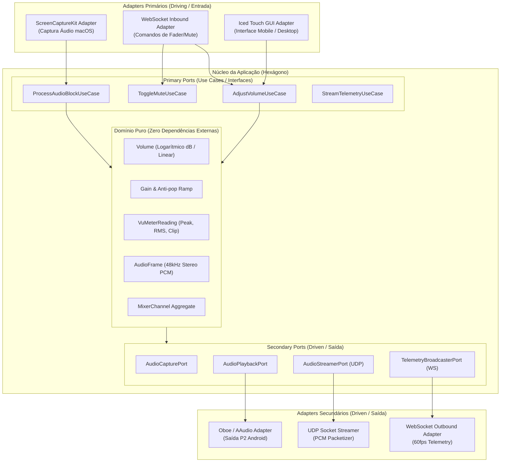

# Audio Mixing Console & Low-Latency Streaming (Rust + Clean Architecture)

Implementação de uma mesa de mixagem e streaming de áudio de alta performance em Rust 1.75+, aplicando rigorosamente **Clean Architecture (Arquitetura Hexagonal / Ports & Adapters)**, **Domain-Driven Design (DDD)** e padrões modernos de concorrência assíncrona (Tokio) e DSP lock-free.

---

## 🏛️ Arquitetura Hexagonal (Ports & Adapters)



---

## 📐 Regras de Dependência e Camadas (Clean Architecture)

1. **Camada de Domínio (`domain`)**:
   - Totalmente pura, sem dependência de frameworks de áudio, I/O ou rede.
   - Tipos de Valor imutáveis e protegidos por invariantes: `DecibelVolume`, `LinearGain`, `VuMeterReading`, `AudioBuffer`.
   - Agregado `MixerState` com regras de transição suave de ganho (anti-pop).
2. **Camada de Aplicação (`application` / Casos de Uso & Ports)**:
   - **Primary Ports**: `AdjustVolumeUseCase`, `ToggleMuteUseCase`, `ProcessAudioUseCase`.
   - **Secondary Ports**: Interfaces abstratas em Rust (`traits`) para `AudioCapturePort`, `AudioPlaybackPort`, `AudioStreamerPort`, `TelemetryBroadcasterPort`.
3. **Camada de Infraestrutura e Adapters (`adapters` / `infrastructure`)**:
   - Implementações concretas isoladas:
     - `ScreenCaptureKitAdapter` (macOS native capture)
     - `OboeAudioPlaybackAdapter` (Android AAudio low-latency)
     - `UdpAudioStreamerAdapter` (UDP packetizer)
     - `WebSocketServerAdapter` e `WebSocketClientAdapter` (Tokio Tungstenite)
     - `IcedConsoleAdapter` (Iced GUI touch surface)

---

## 🦀 Padrões de Engenharia Rust 1.75+

- **Zero-Cost Abstractions & Newtype Pattern**:
  `DecibelVolume(f32)` e `LinearGain(f32)` para garantia em tempo de compilação contra misturas de grandezas físicas de áudio.
- **Isolamento de Threads de Áudio (Lock-Free)**:
  Comunicação entre a thread de tempo real de áudio (CoreAudio/Oboe) e o runtime assíncrono Tokio através de `ringbuf::HeapRb` (SPSC lock-free ring buffer), eliminando deadlocks, contenção de mutexes e jitter.
- **Gerenciamento de Erros Estruturado**:
  `thiserror` para tipos de erro de domínio e de portas bem tipados, com mapeamento explícito nas bordas.
- **Cargo Workspace com Dependency Inheritance**:
  Centralização de versões no `[workspace.dependencies]` do `Cargo.toml` raiz.

---

## Proposed Changes

### Cargo Workspace Setup

#### [NEW] [Cargo.toml](file:///Users/mferovante/Documents/workspace/AudioMixingConsoleStreaming/Cargo.toml)
Configuração do workspace com herança de dependências (`workspace.dependencies`), perfil release otimizado (`lto = true`, `opt-level = 3`, `codegen-units = 1`).
Membros:
- `crates/protocol`
- `crates/core` (Domínio puro e Casos de Uso)
- `crates/server` (Backend macOS com ScreenCaptureKit e Tokio)
- `crates/client` (Cliente Android com Iced e Oboe)

#### [NEW] [rustfmt.toml](file:///Users/mferovante/Documents/workspace/AudioMixingConsoleStreaming/rustfmt.toml)
Configuração padrão de formatação Rust 2021.

#### [NEW] [clippy.toml](file:///Users/mferovante/Documents/workspace/AudioMixingConsoleStreaming/clippy.toml)
Limites de complexidade cognitiva e regras estritas de linting.

---

### Shared Protocol (`crates/protocol`)

Contratos de dados serializados e formato de datagramas binários entre Mac e Android.

#### [NEW] [crates/protocol/Cargo.toml](file:///Users/mferovante/Documents/workspace/AudioMixingConsoleStreaming/crates/protocol/Cargo.toml)
#### [NEW] [crates/protocol/src/lib.rs](file:///Users/mferovante/Documents/workspace/AudioMixingConsoleStreaming/crates/protocol/src/lib.rs)
- DTOs de comando de controle (`ControlCommandDto`: `SetVolume`, `ToggleMute`, `SetDim`).
- DTOs de telemetria (`TelemetryPacketDto`: `VuMeter`, `Stats`).
- Cabeçalho binário UDP (`AudioPacketHeader`: seq, timestamp, sample_count).

---

### Core Domain & Application (`crates/core`)

Núcleo de domínio puro e casos de uso (100% testável em memória sem I/O).

#### [NEW] [crates/core/Cargo.toml](file:///Users/mferovante/Documents/workspace/AudioMixingConsoleStreaming/crates/core/Cargo.toml)
Dependências mínimas: `thiserror`.

#### [NEW] [crates/core/src/domain/volume.rs](file:///Users/mferovante/Documents/workspace/AudioMixingConsoleStreaming/crates/core/src/domain/volume.rs)
Value objects imutáveis: `DecibelVolume`, `LinearGain`, `MuteState` com curvas logarítmicas de fader de broadcast (-inf a +6dB) e interpolação linear anti-pop.

#### [NEW] [crates/core/src/domain/vu_meter.rs](file:///Users/mferovante/Documents/workspace/AudioMixingConsoleStreaming/crates/core/src/domain/vu_meter.rs)
Cálculo de Peak e RMS em blocos estéreo com detecção de clipping.

#### [NEW] [crates/core/src/domain/audio_frame.rs](file:///Users/mferovante/Documents/workspace/AudioMixingConsoleStreaming/crates/core/src/domain/audio_frame.rs)
Entidade de buffer PCM com invariantes de taxa de amostragem (48kHz) e canais.

#### [NEW] [crates/core/src/ports/primary.rs](file:///Users/mferovante/Documents/workspace/AudioMixingConsoleStreaming/crates/core/src/ports/primary.rs)
Traits dos Use Cases (Primary Ports):
- `ProcessAudioUseCase`
- `AdjustVolumeUseCase`
- `ToggleMuteUseCase`

#### [NEW] [crates/core/src/ports/secondary.rs](file:///Users/mferovante/Documents/workspace/AudioMixingConsoleStreaming/crates/core/src/ports/secondary.rs)
Traits dos Adapters (Driven Ports):
- `AudioCapturePort`
- `AudioPlaybackPort`
- `AudioStreamerPort`
- `TelemetryBroadcasterPort`

#### [NEW] [crates/core/src/application/service.rs](file:///Users/mferovante/Documents/workspace/AudioMixingConsoleStreaming/crates/core/src/application/service.rs)
Implementação do `MixerService` orquestrando o pipeline de DSP e despachando para os Driven Ports.

---

### Mac Server Backend (`crates/server`)

Adapters de captura, rede assíncrona e servidor de controle para macOS.

#### [NEW] [crates/server/Cargo.toml](file:///Users/mferovante/Documents/workspace/AudioMixingConsoleStreaming/crates/server/Cargo.toml)
Dependências: `core`, `protocol`, `tokio`, `tokio-tungstenite`, `screencapturekit`, `cpal`, `ringbuf`, `tracing`.

#### [NEW] [crates/server/src/adapters/capture_screencapturekit.rs](file:///Users/mferovante/Documents/workspace/AudioMixingConsoleStreaming/crates/server/src/adapters/capture_screencapturekit.rs)
Driving/Driven Adapter para ScreenCaptureKit no macOS, capturando áudio de saída digital do sistema.

#### [NEW] [crates/server/src/adapters/udp_streamer.rs](file:///Users/mferovante/Documents/workspace/AudioMixingConsoleStreaming/crates/server/src/adapters/udp_streamer.rs)
Driven Adapter para envio de pacotes UDP de baixa latência para o cliente Android.

#### [NEW] [crates/server/src/adapters/ws_server.rs](file:///Users/mferovante/Documents/workspace/AudioMixingConsoleStreaming/crates/server/src/adapters/ws_server.rs)
Driving/Driven Adapter WebSocket tokio para receber alterações dos faders e emitir telemetria a 60fps.

#### [NEW] [crates/server/src/main.rs](file:///Users/mferovante/Documents/workspace/AudioMixingConsoleStreaming/crates/server/src/main.rs)
Composition Root (Injeção de dependências e inicialização dos adaptadores).

---

### Mobile Client Console (`crates/client`)

Adapters para a interface Iced e engine de áudio Oboe no Android 12+.

#### [NEW] [crates/client/Cargo.toml](file:///Users/mferovante/Documents/workspace/AudioMixingConsoleStreaming/crates/client/Cargo.toml)
Dependências: `core`, `protocol`, `iced`, `oboe`, `tokio`, `tokio-tungstenite`, `ringbuf`, `tracing`.

#### [NEW] [crates/client/src/adapters/oboe_playback.rs](file:///Users/mferovante/Documents/workspace/AudioMixingConsoleStreaming/crates/client/src/adapters/oboe_playback.rs)
Driven Adapter conectando com Google Oboe / AAudio em modo de baixa latência direcionando para a saída P2/fone.

#### [NEW] [crates/client/src/adapters/udp_receiver.rs](file:///Users/mferovante/Documents/workspace/AudioMixingConsoleStreaming/crates/client/src/adapters/udp_receiver.rs)
Driving Adapter recebendo áudio UDP com ring buffer lock-free para absorção de micro-jitter.

#### [NEW] [crates/client/src/adapters/ws_client.rs](file:///Users/mferovante/Documents/workspace/AudioMixingConsoleStreaming/crates/client/src/adapters/ws_client.rs)
Driving Adapter para comunicação contínua de controle com o servidor Mac.

#### [NEW] [crates/client/src/ui/console_view.rs](file:///Users/mferovante/Documents/workspace/AudioMixingConsoleStreaming/crates/client/src/ui/console_view.rs)
Driving Adapter gráfico em Iced:
- Fader Master vertical com mapeamento de toque e escala em dB.
- VU Meter estéreo responsivo (Gradiente estúdio + Peak hold + Clipping).
- Botões tácteis iluminados de Mute e Dim.
- Painel de telemetria de rede (RTT em ms, Jitter buffer, IP).

#### [NEW] [crates/client/src/main.rs](file:///Users/mferovante/Documents/workspace/AudioMixingConsoleStreaming/crates/client/src/main.rs)
Composition Root do cliente mobile / simulador desktop.

---

### Build & Deploy Tooling

#### [NEW] [scripts/build_android.sh](file:///Users/mferovante/Documents/workspace/AudioMixingConsoleStreaming/scripts/build_android.sh)
Script automatizado via `cargo-ndk` e `adb` para compilar e instalar no dispositivo Android conectado.

---

## Verification Plan

### Automated Tests
- Testes unitários do **Domínio Puro** (sem mocks e sem I/O):
  ```bash
  cargo test -p core
  ```
- Testes de integração com **Mocks dos Driven Ports** (validando use cases em memória):
  ```bash
  cargo test -p core --test use_cases_test
  ```
- Testes de serialização e contrato de protocolo:
  ```bash
  cargo test -p protocol
  ```
- Execução completa de testes e lints:
  ```bash
  cargo test --workspace
  cargo clippy --workspace -- -D warnings
  ```

### Manual Verification
1. **Simulação Desktop no macOS**:
   - `cargo run -p server`
   - `cargo run -p client`
   - Testar faders, botões de mute/dim, telemetria e saída de som localmente.
2. **Deploy no Dispositivo Android (Android 12+)**:
   - Conectar o smartphone via USB-C com ADB ativo.
   - Executar `./scripts/build_android.sh`.
   - Validar áudio pela saída P2 e controle tátil do console via Wi-Fi.
